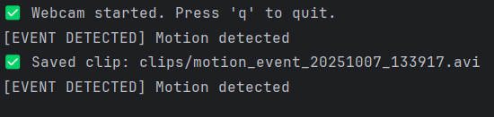
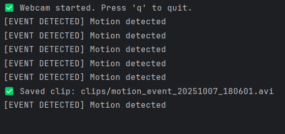
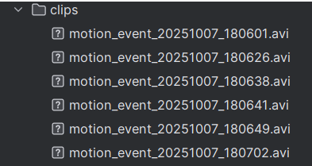
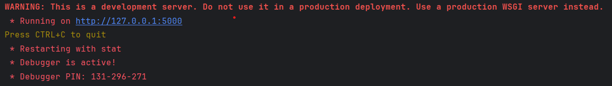
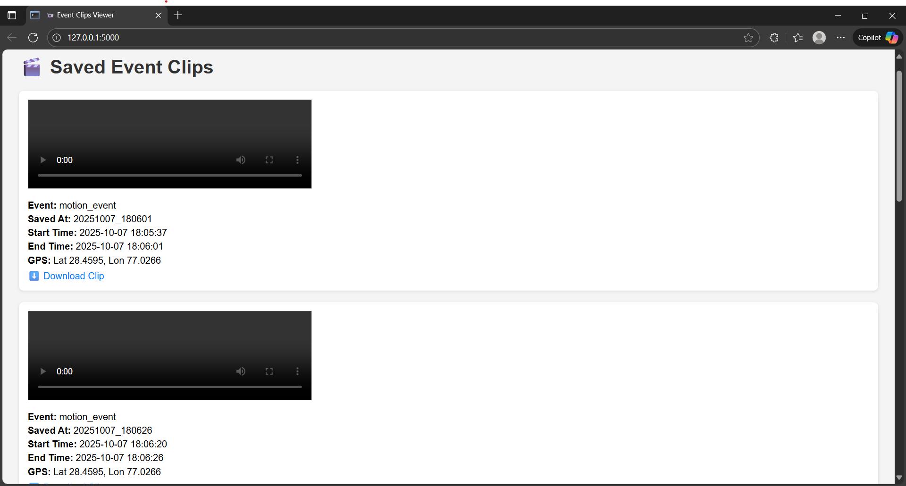
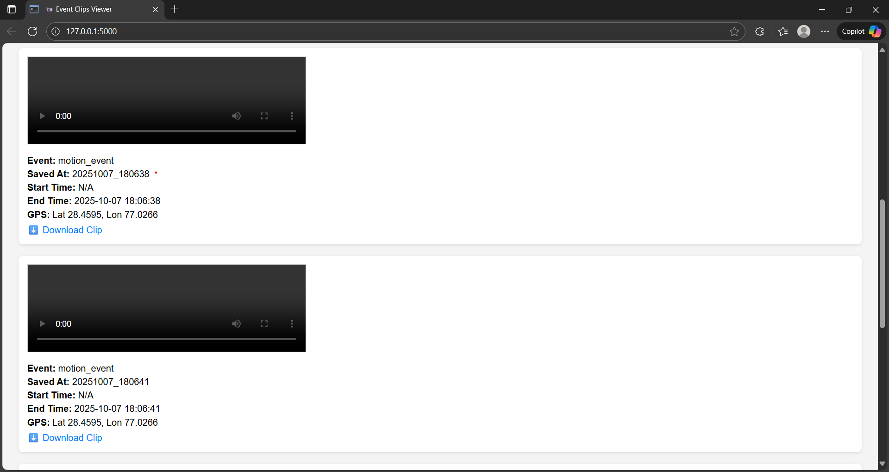
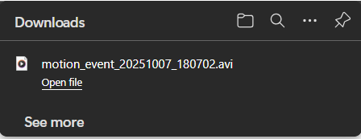

# 📹 Event-Based Video Recorder with Flask Viewer

A modular Python project that simulates an **AI-powered video recording system** — capturing and saving clips only when specific events are detected.
Built with OpenCV, Flask, and a mock AI detector, this system mimics real-world fleet or driver monitoring setups.

---

## 🚀 Features

- 🎥 Live video buffering from webcam.
- 🤖 Simulated AI event detection (e.g., drowsiness, phone usage).  
- 📁 Automatic clip saving (15s before + 15s after event).
- 🧭 Metadata logging with timestamp and GPS.
- 🌐 Flask web interface to browse and download clips.  
- 🎛️ Configurable resolution and FPS.

---

## 🧠 How It Works

1. **Live Feed**: Captures video continuously and stores recent frames in a buffer.  
2. **Event Detection**: A mock AI randomly triggers events every 10–30 seconds.  
3. **Clip Recording**: When triggered, the system saves a 30-second clip around the event.  
4. **Metadata Logging**: Each clip is tagged with event type, timestamp, and simulated GPS.  
5. **Web Viewer**: A Flask app displays all saved clips and allows downloads.  

---

## 📁 Project Structure
    Event-Based Video Recorder with Flask Viewer/
    ├── main.py                 # Core motion detection and recording logic
    ├── buffer.py               # Video buffering logic
    ├── detector.py             # Mock AI event detection
    ├── recorder.py             # Clip saving + metadata logging
    ├── viewer.py               # Flask web interface
    ├── motion_detector.py      # Optimized motion detection algorithm
    ├── requirement.txt         # Dependencies
    ├── metadata.json           # Metadata for each saved clip
    ├── Screenshots/            # Sample use case
    └── clips/                  # Saved video clips

---

## 🛠️ Technologies Used

- Python 3
- OpenCV
- Flask
- Threading
- JSON metadata
- HTML/CSS (inline via Flask)

---
## 📸 Screenshots

### Live Feed / Webcam Started:


### Event Trigger:


### Saved Clip:


### Flask Viewer Interface:






### Clips Downloaded From Flask Interface:


---

## ⚙️ Installation

Clone the repository and install dependencies:
```bash
    git clone https://github.com/yourusername/event-video-recorder.git
    cd event-video-recorder
    pip install -r requirements.txt
```

---

## ▶️ Running the Project
1. Start the video recorder:
```bash
   python main.py
   ```
   - Wait for automatic event triggers
   - Press q to quit
   
2. Launch the Flask viewer:
```bash
   python viewer.py
   ```
- Visit http://127.0.0.1:5000/ in your browser
- Browse and download saved clips

---

## 🛠️ Customization

- **Resolution:** Set in main.py
```
cap.set(cv2.CAP_PROP_FRAME_WIDTH, 1280)
cap.set(cv2.CAP_PROP_FRAME_HEIGHT, 720)
```
- **FPS:** Set in main.py and recorder.py
```
cap.set(cv2.CAP_PROP_FPS, 60)
cv2.VideoWriter(..., 60, ...)
```
- **Buffer Duration:** Set in buffer.py
```
self.buffer = deque(maxlength=900)  → 15s at 60fps
```

---

## 📌 Notes
- Designed for smooth performance at 640×480 resolution and 30 FPS.
- Threading ensures the camera feed never freezes during saving.
- Easily extendable for gesture classification, cloud sync, or mobile alert.

